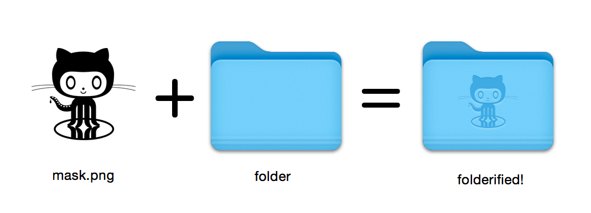
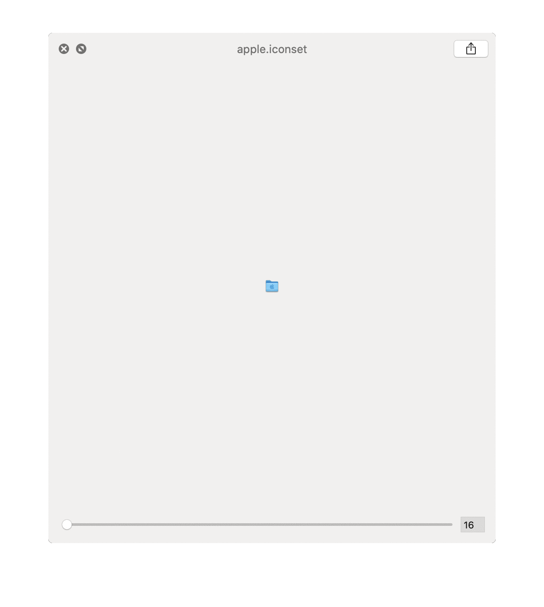

# folderify



Generate pixel-perfect macOS folder icons in the native style.

- Works for OS X 10.5 (Leopard) through macOS 13 (Ventura).
- Automatically includes all icon sizes from `16x16` through `512x512@2x`.
- Light or dark mode (automatically selected by default).

**Using `folderify`?** [Let me know](https://mastodon.social/@lgarron) or [let me know](https://github.com/lgarron/folderify/issues/new) and I'd love to feature some real-world uses!

# Install using [Homebrew](https://formulae.brew.sh/formula/folderify)

```shell
brew install folderify
```

# Usage

Use a mask to assign an icon to a folder:

```shell
folderify mask.png /path/to/folder
```

Generate `mask.icns` and `mask.iconset` files:

```shell
folderify mask.png
```

Generate icon files for a specific version of macOS (the default is your current
version):

```shell
folderify --macOS 11.0 mask.png
```

By default, `folderify` uses your system's current light/dark mode. Use `--color-scheme` to override this:

```shell
folderify --macOS 11.0 --color-scheme dark mask.png
```

Note:

- There is currently no simple way to set an icon that will automatically switch between light and dark when you switch the entire OS. You can only assign one version of an icon to a folder.
- Dark color scheme is only supported for macOS 11.0 (and later) right now.

## Tips

For best results:

- Use a `.png` mask.
- Use a solid black design over a transparent background.
- Make sure the corner pixels of the mask image are transparent. They are used for empty margins.
- Pass the `--no-trim` flag and use a mask:
  - with a height of 384px,
  - with a width that is a multiple of 128px (up to 768px),
  - using a 16px grid.
  - Each 64x64 tile will exactly align with 1 pixel at the smallest icon size.

# Other installation options

If you don't have Homebrew but you already have ImageMagick (the `convert`
binary) on your system, you can use the following:

## Install using Rust

```shell
cargo install folderify
```

## From source

Or download the code directly:

```shell
git clone https://github.com/lgarron/folderify && cd folderify

# Run directly
cargo run -- --reveal examples/src/folder_outline.png .

# Install (assuming the `cargo` bin is in your path)
cargo install --path .
folderify --reveal examples/src/folder_outline.png .
```

The repository folder should now have a custom icon.

```shell
for file in examples/src/*.png; do cargo run -- $file; done
open examples/src/
```

You should see a bunch of new `.iconset` folders and `.icns` files that were automatically generated from the `.png` masks.

## Dependencies

- [ImageMagick](https://www.imagemagick.org/) - for image processing (you should be able to run <code>convert</code> and <code>identify</code> on the commandline).
- Included with macOS:
  - `iconutil`
- `sips`, `DeRez`, `Rez`, `SetFile` (You need Xcode command line tools for some of these.)

# Full options

```
Generate a native-style macOS folder icon from a mask file.

Usage: folderify [OPTIONS] [MASK] [TARGET]

Arguments:
  [MASK]
          Mask image file. For best results:
          - Use a .png mask.
          - Use a solid black design over a transparent background.
          - Make sure the corner pixels of the mask image are transparent. They are used for empty margins.
          - Make sure the non-transparent pixels span a height of 384px, using a 16px grid.
          If the height is 384px and the width is a multiple of 128px, each 64x64 tile will exactly align with 1 pixel at the smallest folder size.

  [TARGET]
          Target file or folder. If a target is specified, the resulting icon will
          be applied to the target file/folder. Else (unless --output-icns or
          --output-iconset is specified), a .iconset folder and .icns file will be
          created in the same folder as the mask (you can use "Get Info" in Finder
          to copy the icon from the .icns file).

Options:
      --output-icns <OUTPUT_ICNS>
          Write the `.icns` file to the given path.
          (Will be written even if a target is also specified.)

      --output-iconset <OUTPUT_ICONSET>
          Write the `.iconset` folder to the given path.
          (Will be written even if a target is also specified.)

  -r, --reveal
          Reveal either the target, `.icns`, or `.iconset` (in that order of preference) in Finder

      --macOS <MAC_OS>
          Version of the macOS folder icon, e.g. "10.13". Defaults to the version currently running

      --color-scheme <COLOR_SCHEME>
          Color scheme — auto matches the current system value
          
          [default: auto]
          [possible values: auto, light, dark]

      --no-trim
          Don't trim margins from the mask.
          By default, transparent margins are trimmed from all 4 sides.

  -v, --verbose
          Detailed output

      --completions <SHELL>
          Print completions for the given shell (instead of generating any icons).
          These can be loaded/stored permanently (e.g. when using Homebrew), but they can also be sourced directly, e.g.:
          
           folderify --completions fish | source # fish
           source <(folderify --completions zsh) # zsh
          
          [possible values: bash, elvish, fish, powershell, zsh]

  -h, --help
          Print help (see a summary with '-h')

  -V, --version
          Print version
```

---

Example generated from the Apple logo:

